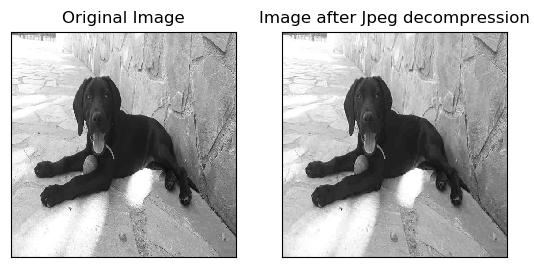

# jpeg-compression

This python program implements the [JPEG algorithm](https://en.wikipedia.org/wiki/JPEG) for compressing and 
decompressing images.

## Usage

```bash
py .\src\jpeg_compression.py <input_image> <multiplying_factor>
```

- As the multiplying factor increases, the image quality loss and the compression ratio increase.

## Example

```bash
py .\src\jpeg_compression.py data/sammy.tif 2.0
MSE =  65.32288718985515
PSNR =  29.9801498910653
SSIM =  0.8000301386396013
Compression Ratio =  0.2612508847993613
```

## Author

Giorgos Argyrides (g.aryrides@outlook.com)
